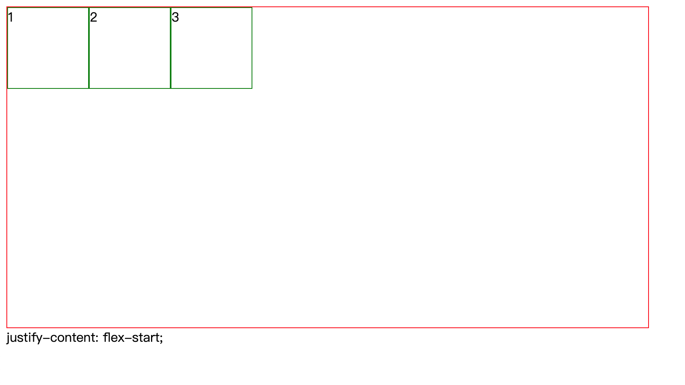
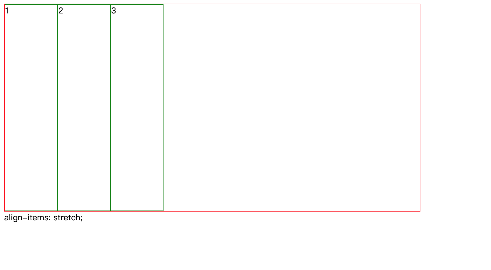
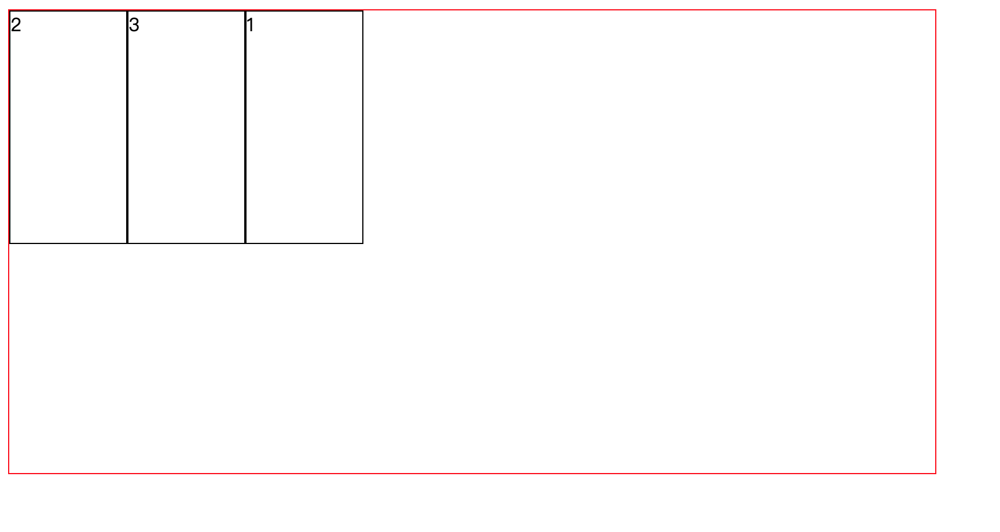

## 什么是 flex 布局？

**flex 是 Flexible Box 的缩写，意为"弹性布局"，是 CSS 布局的方式之一，flex 布局已经支持大多数浏览器**

## flex 布局的结构

Flex 布局由容器 container 和容器内的元素 items 构成


## 如何使用 flex 布局？

使用 flex 布局比较简单，只需要在 CSS 中声明容器是 flex 容器就可以使用 flex 布局

```HTML
<div class="container"></div>
```

```CSS
.container{
    display:flex/inline-flex;
}
```

## 容器的样式

1.  items 的流动方式(主轴方向):

    ```CSS
    .container{
        flex-direction:row/row-reverse/column/column-reverse
    }
    ```

    

    

    

    

    **一个小 bug: 当 items 过多的时候不会另起一行，而是会挤压，items 会变小**

2.  items 换行:

    ```CSS
    .container{
        flex-wrap:nowrap/wrap/wrap-reverse;
    }
    ```

    nowrap 是默认值，不换行

3.  主轴对齐方式:

    ```CSS
    .container{
        justify-content:flex-start/flex-end/center/space-between/space-around/space-evenly;
    }
    ```

    

    

    

    

    

    

    **默认主轴是横轴**

4.  次轴对齐:

    ```CSS
    .container{
        align-items:flex-start/flex-end/center/stretch;
    }
    ```

    

    

    

    

    **默认次轴是纵轴**

5.  多行内容(不常用):

    ```CSS
    .container{
        align-content:flex-start/flex-end/center/stretch/space-between/space-around;
    }
    ```

## 容器内元素(items)样式

1.  order 属性:

    用于改变 items 的显示顺序，以 order 值从小到大的排序，默认值是 0;

    ```HTML
    <div class="container">
     <div class="items">1</div>
     <div class="items">2</div>
     <div class="items">3</div>
    </div>
    ```

    ```CSS
     .container {
         border: 1px solid red;
         width: 800px;
         height: 400px;
         display: flex;
       }

       .items:first-child {
         width: 100px;
         height: 200px;
         order: 100;
         border: 1px solid #000;
       }

       .items:nth-child(2) {
         width: 100px;
         height: 200px;
         order: 2;
         border: 1px solid #000;
       }

       .items:nth-child(3) {
         width: 100px;
         height: 200px;
         order: 30;
         border: 1px solid #000;
       }
    ```

    

2.  flex-grow 属性:

    按属性值的比例分配剩余空间，0 为不分配

    ```HTML
    <div class="container">
      <div class="items">1</div>
      <div class="items">2</div>
      <div class="items">3</div>
    </div>
    ```

    ```CSS
      .container {
        border: 1px solid red;
        width: 800px;
        height: 400px;
        display: flex;
      }

      .items:first-child {
        flex-grow: 1;
        height: 50%;
        border: 1px solid black;
      }

      .items:nth-child(2) {
        flex-grow: 2;
        height: 50%;
        border: 1px solid black;
      }

      .items:nth-child(3) {
        flex-grow: 0;
        height: 50%;
        border: 1px solid black;
      }
    ```

    

3.  flex-shrink 属性:

    在视窗大小不足时，控制收缩的速率，0 为不收缩

4.  align-self 属性:

    对单个 item 进行 align-items 的调整

## 常用的 flex 代码

- display:flex;

- flex-direction:row/column;

- flex-wrap:wrap;

* justify-content:center/space-between;

* align-center:center;

## flex 布局应用

[flex 布局例子](http://js.jirengu.com/zopucucehu/1/edit?html,css,output)
