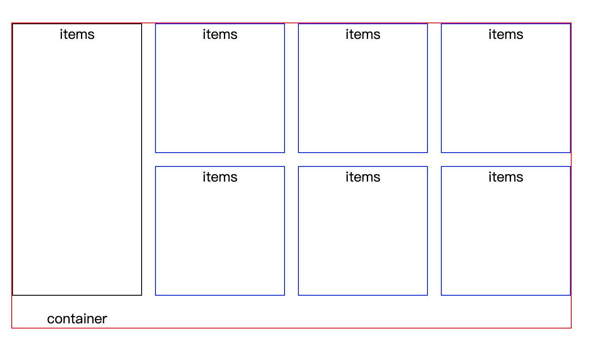
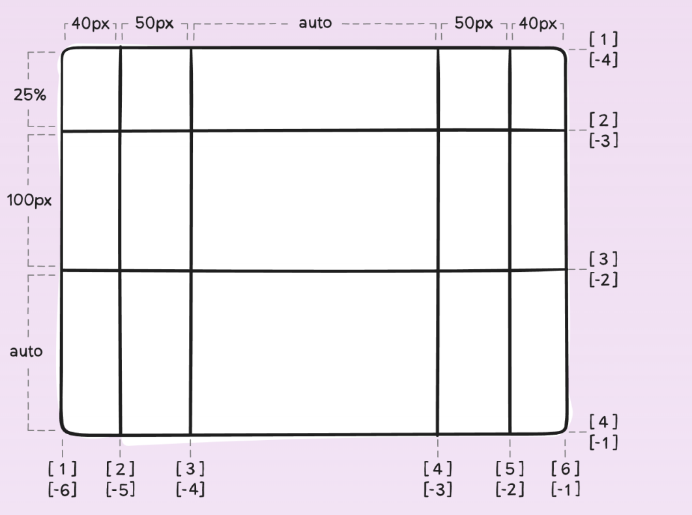
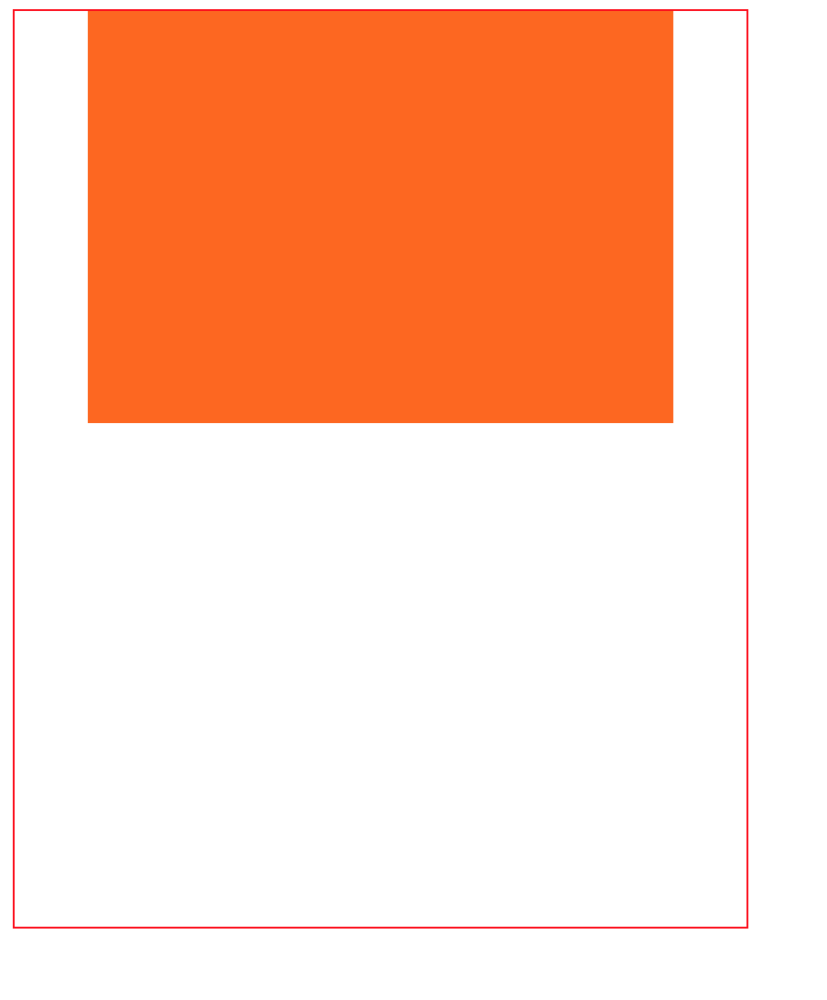

# grid 布局简介

**grid 布局是 CSS 一种功能强大的布局方案，常用于二维布局**

# grid 的布局结构

和 flex 布局一样，grid 布局也分为容器部分(container)和容器内元素部分(items)



# 如何使用 grid 布局？

使用 grid 布局比较简单，只需要在 CSS 中声明容器是 grid 容器就可以使用 grid 布局

```HTML
<div class="container"></div>
```

```CSS
.container{
    display:grid/inline-grid;
}
```

# 划分 grid 容器

grid-template-rows 属性用于划分网格行

grid-template-columns 属性用于划分网格列

属性的取值可以是非负数长度，可以是百分数，也可以是 fr

fr 是将空间按照份数成比例划分

```CSS
.container{
    grid-template-rows:25% 100px auto;
    grid-template-columns:40px 50px auto 50px 40px;
}
```



# 如何为 items 选定范围？

只需要确定构成 item 范围的四根线则可以确定 item 的范围，通过以下四个属性则可以确定

- grid-column-start
- grid-column-end
- grid-row-start
- grid-row-end

```CSS
.items:nth-child(x){
      grid-column-start:2;
      grid-column-end:5;
      grid-row-start:1;
      grid-row-end:3;
}
```

# 划分例子

```HTML
    <div class="container">
        <div class="item"></div>
    </div>
```

```CSS
    .container {
        width: 400px;
        height: 500px;
        display: inline-grid;
        grid-template-rows: 25% 100px auto;
        grid-template-columns: 40px 50px auto 50px 40px;
        border: 1px solid red;
        }

    .item {
        background-color: #f60;
        grid-column-start: 2;
        grid-column-end: 5;
        grid-row-start: 1;
        grid-row-end: 3;
        }
```



# grid 分区

- 在分区的时候，我们可以采用 areas 属性去完成分区，通过给每个区起名字来完成分区

```CSS
.container{
    grid-template-areas:
        "big sm1 sm2 sm3"
        "big sm4 sm5 sm6"
        ;
}
```

- 用 grid-area 属性为 item 指定分区

```CSS
.container > .item{
        grid-area:big;
}
```

# grid 内 item 空隙

用 grid-row-gap 和 grid-column-gap 去声明

```CSS
.container{
        grid-column-gap:15px;
        grid-row-gap:15px;
}
```

# grid 分区例子

[grid 分区例子](http://js.jirengu.com/laqin/2/edit?html,css,output)
