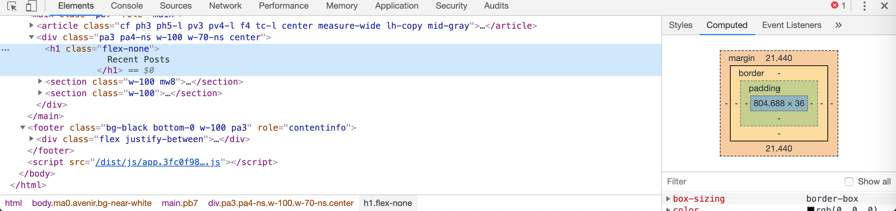
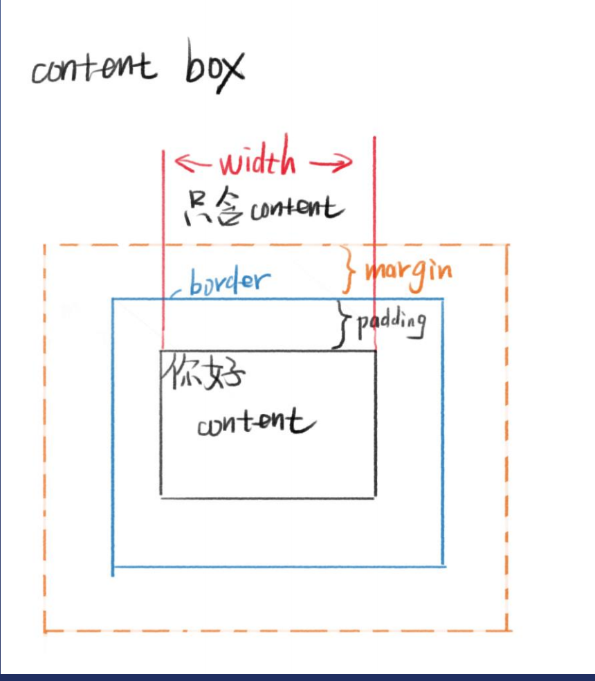
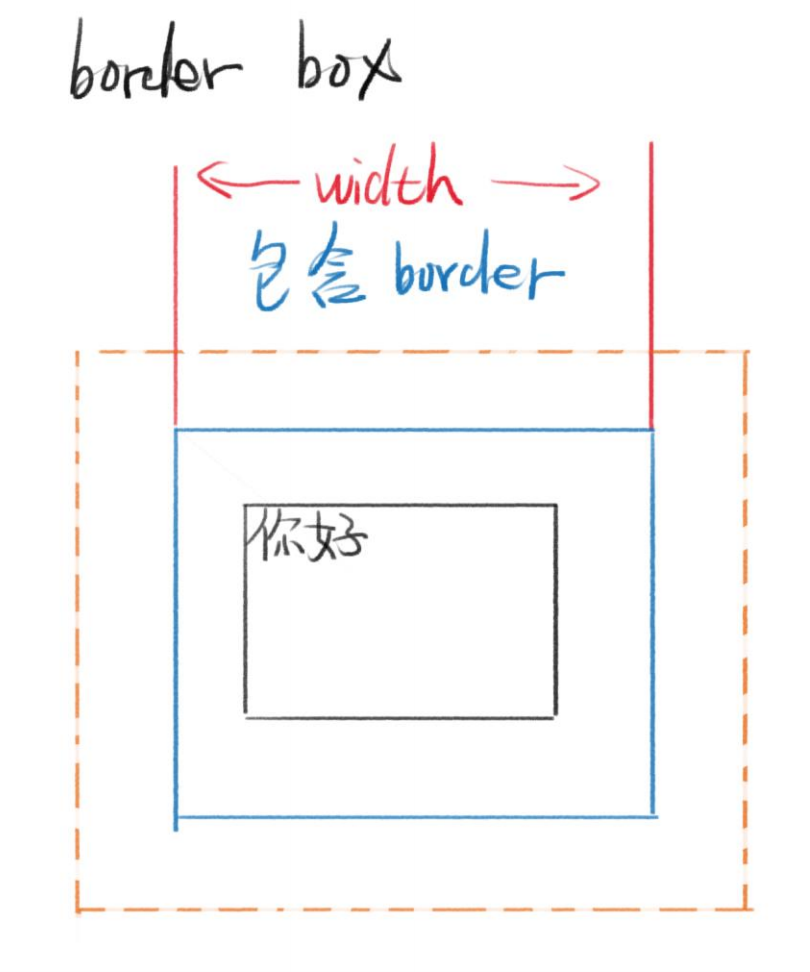
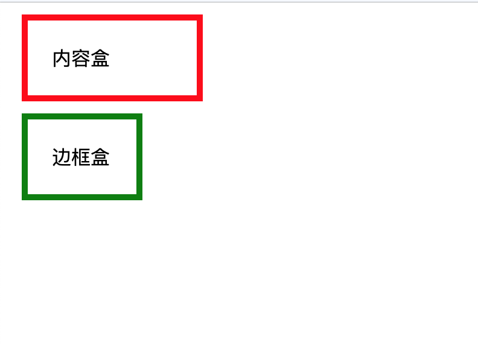

# CSS盒模型

**盒模型是CSS的重点之一，也是难点之一**

**CSS盒模型本质上是一个盒子，封装周围的HTML元素，它包括：边距，边框，填充，和实际内容。**

**盒模型允许我们在其它元素和周围元素边框之间的空间放置元素。**

**当我们在浏览器中按下F12 就可以看到元素的盒模型**



1. 盒模型基本元素:
    * 宽度:width
    * 高度height
    * 边距:margin
    * 边框:border
    * 内边距:padding(一个元素的内容和其边界之间的空间)
    * 内容区content

2. 盒模型的分类:
   
    盒模型分为content-box和border-box两种

    在声明时用box-sizing:content-box/border-box来声明

3. content-box:
   
    content-box是指内容盒，内容就是盒子的边界

    在content-box中 

    width = 内容的宽度

    盒子的大小 = border + padding + 内容的宽度

    

4.  border-box:

    border-box是指边框盒，边框才是盒子的边界

    在border-box中

    width = border + padding + 内容区

    盒子的大小 = width

    


用实际体会一下两者的不同:

```HTML
<body>
<div class="content-box">内容盒</div>
<div class="border-box">边框盒</div>
</body>
```

```CSS
.content-box{
  margin: 10px;
  padding:20px;
  border:5px solid red;
  box-sizing:content-box;
  width: 100px;
}
.border-box{
  margin: 10px;
  padding:20px;
  border:5px solid green;
  box-sizing:border-box;
  width: 100px;
}
```
在这两种不同的盒模型中，div的显示效果如图



注:本页图片转自杭州饥人谷教育