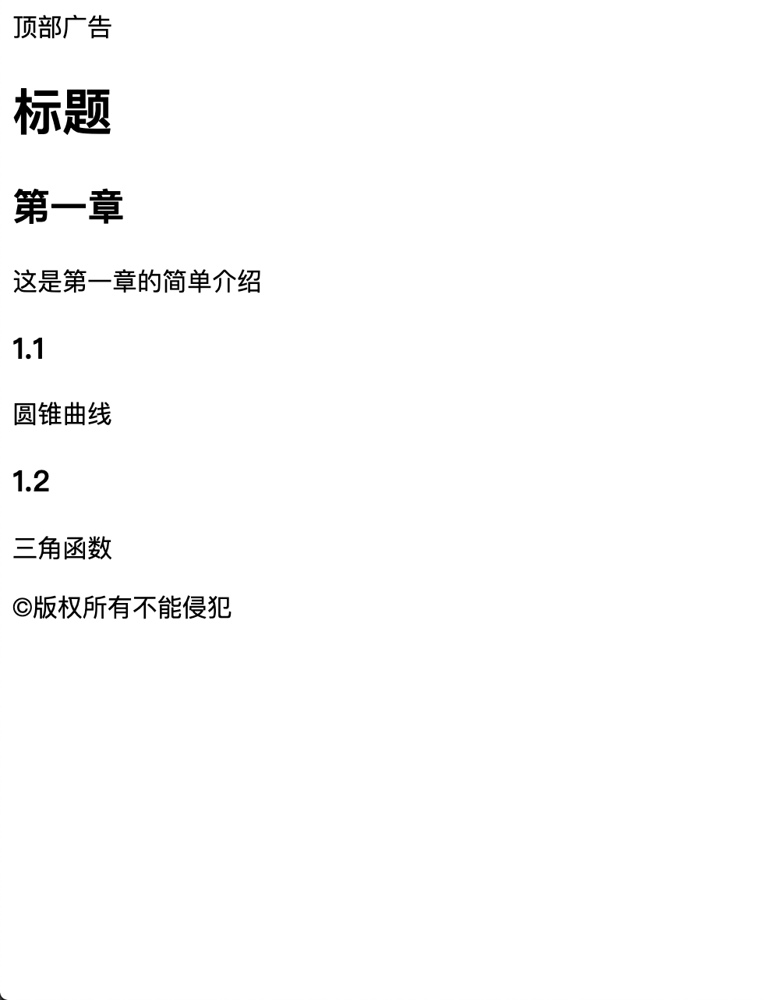

# HTML入门

## HTML的由来:
    HTML 是由蒂姆·伯纳斯－李（Tim Berners-Lee）创建
## HTML的起手:
   在Vscode中创建html文件后，在英文状态下输入!后按tab键就会生成html的基本结构
## HTML基本结构的含义:
   1. `<!DOCTYPE html>`   
      告诉浏览器文档类型是html
   
   2. `<html lang="en"> `   
      告诉浏览器页面的语言是英语，可以改为zh-CN，网页的语言就是中文。在浏览器的翻译功能中，就是依赖该字段去翻译。
   
   3. `<meta charset="UTF-8" />`    
      告诉浏览器文件的字符编码是UTF-8
   
   4. `<meta name="viewport" content="width=device-width, initial-scale=1.0" />`     
      禁用缩放，兼容手机
   5. `<meta http-equiv="X-UA-Compatible" content="ie=edge" />`
      
      告诉IE浏览器使用最新的内核

   6. `<title>Document</title>`

      该页面的标题为Document,用户可修改

## 章节标签
 1. 标题标签  h1--h6:
     ```HTML
     <h1>标题1</h1>
     <h2>标题2</h2>
     <h3>标题3</h3>
     <h4>标题4</h4>
     <h5>标题5</h5>
     <h6>标题6</h6>
     ```

2. 章节标签:
   ```HTML
   <section>章节</section>
   ```

3. 段落标签:
   ```HTML
   <p>这是一段话······</p>
   ```

4. 头部标签:
   ```HTML
   <header>这是头部</header>
   ```

5. 尾部标签:
   ```HTML
   <footer>这是尾部</footer>
   ```

6. 主要内容:
   ```HTML
   <main>这是主要内容<main>
   ```
7. 旁支内容(可用于写导航):
   
   ```HTML
   <aside>旁支内容<aside>
   ```

8. 文章标签:
   
   ```HTML
   <article>这是一篇文章<article>
   ```
9.  划分标签:
    
    ```HTML
    <div></div>
    ```
10. 组合运用:
    ```HTML
    <header>顶部广告</header>
    <h1>标题</h1>
    <div>
        <main>
         <section>
            <h2>第一章</h2>
            <p>这是第一章的简单介绍</p>
        </section>
        <section>
            <h3>1.1</h3>
            <p>圆锥曲线</p>
        </section>
        <section>
            <h3>1.2</h3>
            <p>三角函数</p>
        </section>
        </main>
    </div>
    <footer>&copy;版权所有不能侵犯</footer>
    ```
    效果图:
    

## 内容标签:
1. 有序列表:
   
     ol下的内容是指有序列表的内容
     li为列表项
     ```HTML
     <ol>
       <li><li>
       <li><li>
       ···
     <ol>
     ```

2. 无序列表:
   
     ul下的内容是指无序列表的内容
     li为列表项
     ```HTML
     <ul>
       <li><li>
       <li><li>
       ···
     <ul>
     ```

3. 描述列表:
   
     dl下的内容是指描述列表的内容

     dt是被描述对象

     dd是描述内容
     ```
     <dl>
       <dt>Name</dt>    
       <dd>Godzilla</dd>
       <dt>Born</dt>
       <dd>1952</dd>
       <dt>Birthplace</dt>
       <dd>Japan</dd>
       <dt>Color</dt>
       <dd>Green</dd>
     </dl>
     ```

4. pre标签:
   
     用于保留空格、回车等:
     ```HTML
     <p>
        <pre>
        第一章        :            
        盘古开天辟地
        </pre>
     </p>
     ```

5. code标签:
   
     使标签内的字符等宽

6. 水平分割线标签:
   
     画一条水平分割线
     ```HTML
     <hr>
     ```

7. 换行标签:

    另起一行
    ```HTML
    <br>
    ```

8. a标签：
   
     页面跳转等功能实现标签
     ```HTML
     <a href="http://baidu.com">百度</a>
     ```
   
9. 斜体标签:

     标签内的文字斜体
     ```HTML
     <em>我是斜的</em>
     ```

10. 加粗标签

      标签内的文字加粗
      ```HTML
      <strong>我加粗了</strong>
      ```

11. 组合运用:
    ```HTML
    <ol>
        <li>第一</li>
        <li>第二</li>
        <li>第三</li>
        <li>第四</li>
        <li>第五</li>
    </ol>
    <ul>
        <li>苹果</li>
        <li>三星</li>
        <li>谷歌</li>
        <li>微软</li>
    </ul>
    <dl>
      <dt>Name</dt>
      <dd>Godzilla</dd>
      <dt>Born</dt>
      <dd>1952</dd>
      <dt>Birthplace</dt>
      <dd>Japan</dd>
      <dt>Color</dt>
      <dd>Green</dd>
    </dl>
    <p>
        <pre>
            第一章        :            
         盘古开天辟地
         </pre>
    </p>
    <hr>
    下面是<br>重点<br>
    <a href="http://baidu.com">百度</a>
    <em>我是斜的</em>
    <strong>我加粗了</strong>
    ```

    效果图:
    


## 全局属性(所有标签都有)
1. class:
   
     给标签归类，可以写多个
     ```
     <div class="demo"></div>
     <div class="demo1 demo2"></div>
     ```

2. contenteditable:
   
     表示元素是否可被用户编辑。 如果可以，浏览器会修改元素的部件以允许编辑。
     ```HTML
     <div contenteditable>这是一篇文章</div>
     ```

3. hidden:
   
     隐藏标签内容
     ```HTML
     <div hidden>我是六娃</div>
     ```

4. id:
     定义了一个全文档唯一的标识符 (ID)。它用于在链接（使用片段）、脚本和样式（通过 CSS）中辨识元素。

     注:
       * id在HTML中不会报错，但是id有重复时，js会报错

       * js可以直接获取id    

       * window.后的内容作为id名的话，js无法获取
     
     ```HTML
     <div id="xxx"></div>
     ```

     ```javascript
      <script>
          xxx.style.border="1px solid red"
      </script>
     ```


5. style:

     为标签增加样式

     ```HTML
     <div style="background: greenyellow;"></div>
     ```

6. tabindex:
   
     指示其元素是否可以聚焦，以及它是否/在何处参与顺序键盘导航（通常使用Tab键，因此得名）。
     tabindex=负值 (通常是tabindex=“-1”)表示不能通过键盘导航(Tab)来访问到该元素
     tabindex="0" 表示最后一个通过键盘导航(tab)访问到的元素

     ```HTML
     <p tabindex="2">这是第一段</p>
     <div tabindex="1">这是第二段</div>
     <strong tabindex="4">这是第三段</strong>
     <span tabindex="-1">这是第四段</span>
     <em tabindex="0">这是第五段</em>
     ```

7. title:
     当鼠标放在标签内容上时，显示title属性值的内容
     ```HTML
       <p title="文章">
       这是很长的一段话这是很长的一段话这是很长的一段话这是很长的一段话这是很长的一段话这是很长的一段话这是很长的一段话
       </p>
     ```